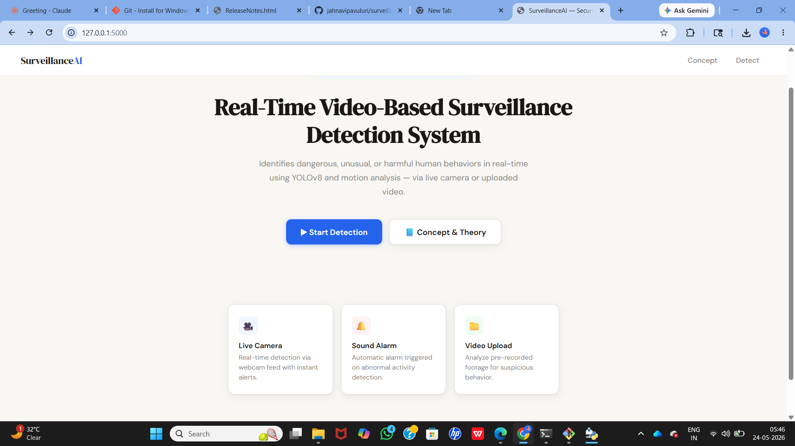
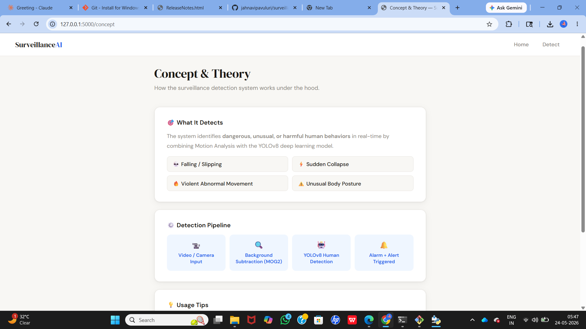
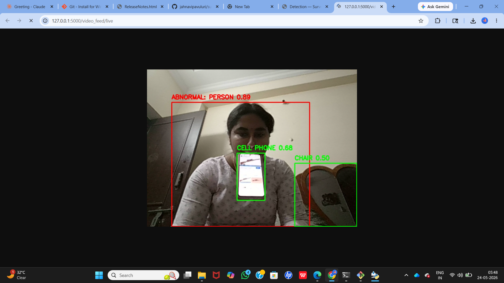

# Real-Time Video-Based Surveillance Detection System
### Using Deep Learning for Security Applications

A real-time abnormal human behavior detection system built using **YOLOv8**, **OpenCV**, and **Flask**.  
The system detects dangerous activities such as falling, sudden collapse, violent movement, and unusual body postures via live camera or uploaded video — and triggers a sound alarm instantly.

---

## 🚀 Features

- 🎥 **Live Camera Detection** — real-time detection via webcam
- 📁 **Video Upload** — process and analyze pre-recorded video files
- 🔴 **Abnormal Activity Alerts** — red bounding box + "ABNORMAL" label on screen
- 🔔 **Sound Alarm** — automatic alarm triggered on threat detection
- 📘 **Concept Overview Page** — explains how the system works
- 🌐 **Flask Web Dashboard** — browser-based interface at `127.0.0.1:5000`

---

## 🧠 How It Works

1. **Background Subtraction** (MOG2) detects sudden motion in the frame
2. **YOLOv8** identifies and locates humans accurately
3. **Motion + YOLO combined** → determines if behavior is abnormal
4. If abnormal: draws red bounding box, labels "ABNORMAL", and triggers alarm

---

## 🗂️ Project Structure

```
surveillance-detection-system/
│
├── app.py                  # Main Flask application
├── requirements.txt        # Python dependencies
│
├── templates/
│   ├── index.html          # Home page
│   ├── concept.html        # Concept & Theory page
│   └── detect.html         # Detection page
│
├── static/
│   └── alarm.mp3           # Alarm sound file
│
└── uploads/                # Uploaded videos (auto-created)
```

---

## ⚙️ Installation & Setup

### 1. Clone the repository
```bash
git clone https://github.com/jahnavipavuluri/surveillance-detection-system.git
cd surveillance-detection-system
```

### 2. Install dependencies
```bash
pip install -r requirements.txt
```

### 3. Add alarm sound
Place an `alarm.mp3` file inside the `static/` folder.

### 4. Run the application
```bash
python app.py
```

### 5. Open in browser
```
http://127.0.0.1:5000
```

---

## 🛠️ Tech Stack

| Technology | Purpose |
|------------|---------|
| Python | Core programming language |
| YOLOv8 (Ultralytics) | Human detection model |
| OpenCV | Video processing & background subtraction |
| Flask | Web framework & dashboard |
| pygame | Sound alarm on detection |

---

## 📸 Screenshots

**Home Page**  


**Concept & Theory Page**  


**Detection System**  
  

---

## 👩‍💻 Developed By

**Pavuluri Jahnavi**
GitHub: [github.com/jahnavipavuluri](https://github.com/jahnavipavuluri)
